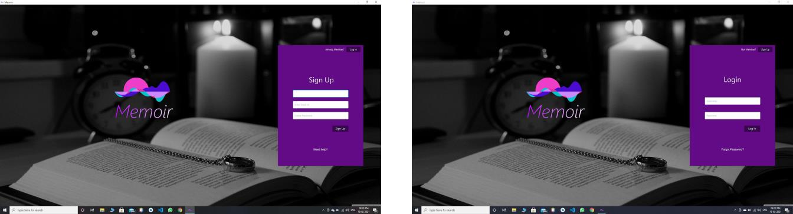
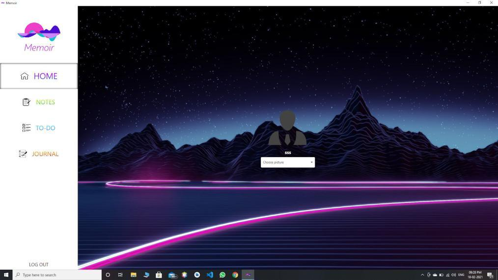
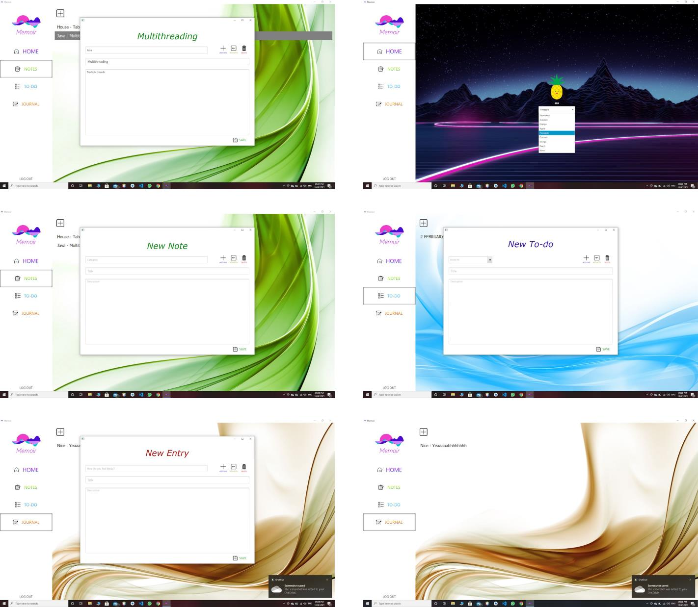

# Memoir ✍

  

Memoir is a cross-platform journal app built using Native Android Java (Mobile), JavaFX (Desktop) and Spring Framework (Backend).

## Team Members

__Android:__ Niranjan B, Salmi Majmal Sheriff, Anjal K K

__JavaFX:__ Amal Nath M, Meenakshi Nair, Dinoy Raj K, Kavya Chandran

__Spring:__ Ajith Kumar PM, Mili Murali, Jijo Johnson

####
Proposal: https://github.com/amalnathm7/Memoir/raw/main/Memoir%20Proposal.pdf

## Abstract
Memoir has a desktop application as well as a mobile app.
The idea is broadly divided into 3 categories.
- To-do
- Journal
- Note Taking

Memoir helps users to jot down the memories and feelings of a particular day. It also
helps to keep a track of the work we need to do and to take notes at a particular time.

## Features
1. Multi Platform Release:

    Memoir can be implemented on multiple computing platforms like Android,
Windows and Linux. It is synchronized using the REST framework.

2. Notes:

    Quick note-taking app with server back-end synchronization and cross-platform
access. Notes taken down can be classified into various categories like Data Structures, OOP
using Java, Logic System Design, etc.

3. Journal:

    A multi-platform application to write down your hidden feelings secured by
authentication to protect your privacy. Server back-end synchronization allows you to access your journal in multiple
operating systems. Journal entries can also be classified into various categories such as Home, College,
Work, etc.

4. To-do:

    A simple to-do list and reminder that will help you keep your busy life organized. 
Different lists can be created for different tasks so that each task can be used for
independent purposes. Server back-end synchronization enable tasks to be accessed by multiple operating
systems.

## Screenshots (Desktop)
  
  

## Installation (Desktop)
Pre-requirements - Java 8
####

Download Memoir Desktop by clicking below 👇

https://github.com/amalnathm7/Memoir/raw/main/Memoir.exe
####

After download, run Memoir.exe

##
### _Write it out, anywhere!_ ✍✨
